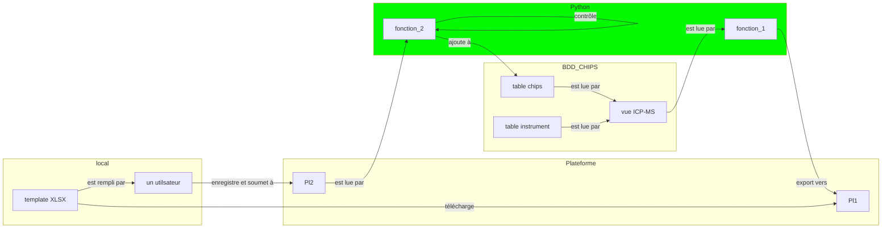

# chips  
> BDD CHImie en PaléoSidérurgie, DB CHIPS

The GitHub repo dedicated to the CHIPS database. Links (work in progress):

- [dashboard](https://iramat-apps.cnrs.fr/dash/)
- [website](https://iramat.github.io/chips/);

## documentation

- 📰 2025, [The CHIPS Database: A Repository for Reference Data on Chemical Analysis in Archaeometallurgy of Iron](https://zenodo.org/records/17244636)
- 🖥️ 2025, [WIAI, présentation de CHIPS](https://github.com/iramat/.github/blob/main/profile/README.md#pass%C3%A9es)

---

# Développement

## Vues
> *Views*

| préfixes    | description                         |
|-------------|-------------------------------------|
| dataset_*      |   jeux de données originaux         |
| figarticle_*   |   données pour la création de graphiques         |
| instrument_*   |   données sur le parc instrumental du labo         |

## Flux de travail



: fichiers/fonctions Python

* `contrôle`
  
  1. vérification des données saisies dans l'XLSX (types attendus, etc.)


* `ajoute à`:
  
  1. effectue un `INSERT INTO` dans la table chips avec auto-incrémentation des indenfiants ❓updates
  2. retourne un rapport: identifiants, etc. ❓Zenodo

#### _refbib

La table `_refbib` regroupe les références bibliographiques des différentes vues (*views*). Ces références sont au format BibTeX et seront mappées pour correspondre aux champs de Zenodo (table de correspondance [bibtex2zenodo.tsv](https://github.com/zoometh/iramat-test/blob/main/projects/citation/bibtex2zenodo.tsv))

* structure

| champs          | description                         |
|-----------------|-------------------------------------|
| ref_table       |  le nom de la table ou de la vue qui sera référencée par la référence bibliographique                             |
| ref_biblio      |  la référence bibliographique au format texte                           |


* ajouter

```sql
INSERT INTO _refbib (ref_table, ref_biblio)
VALUES ('instrument_incertitude','@techreport{Doe2024TechReport,
  author      = {John Doe and Jane Smith},
  title       = {A Comprehensive Guide to Dummy Data Processing},
  institution = {Institute of Advanced Computing},
  year        = {2024},
  number      = {TR-2024-001},
  address     = {New York, USA},
  month       = {February},
  note        = {Available online at \url{https://example.com/techreport}},
}');
```

### à classer

`chips` data -> `chips_d`, _run_: 

```sh
/home/ubuntu/backup_chips_tables.sh
```

erreurs:
* https://zoometh.xyz/dash/dataset_leschenlohr01
* https://zoometh.xyz/dash/dataset_mbenvenuti13


### notes

| champs          | type                         | description                         |
|-----------------|-------------------------------------|-------------------------------------|
| id_machinei         | integer   |                     |  analytical setup used to acquire isotopic amounts              |  
| id_machinem         | integer   |                     |  analytical setup used to measure major elements                |  
| id_machinet         | integer   |                     |  analytical setup used to measure trace elements                |  
